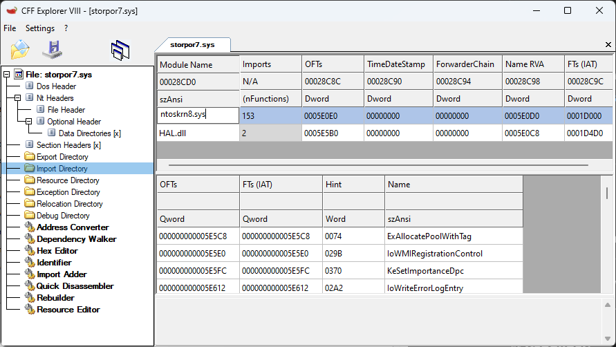
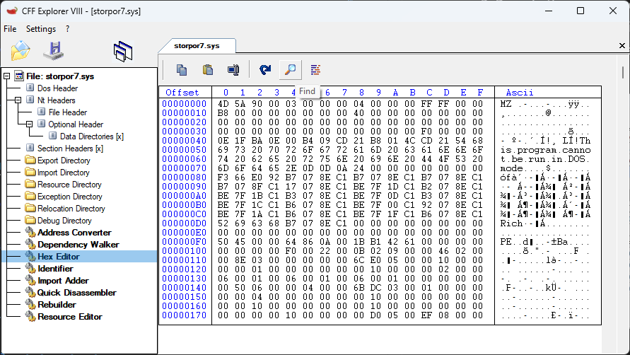
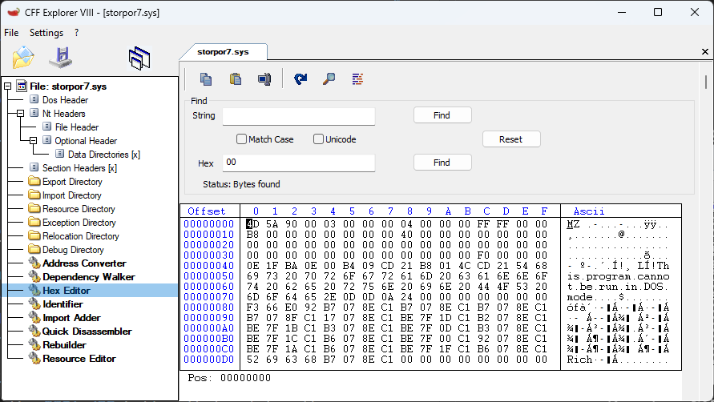
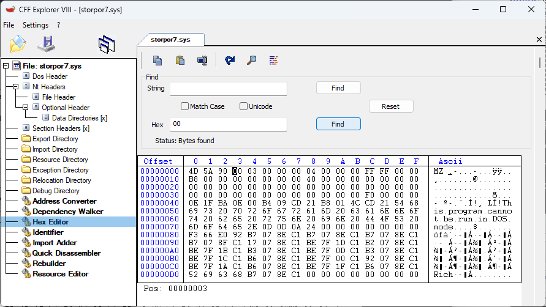
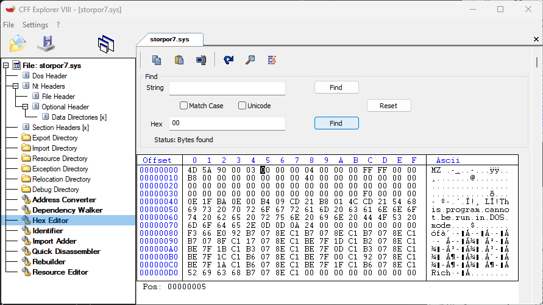
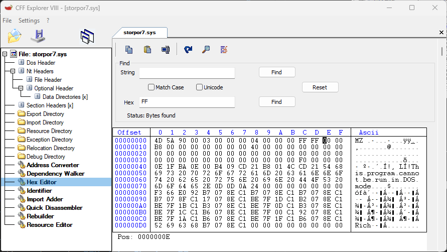
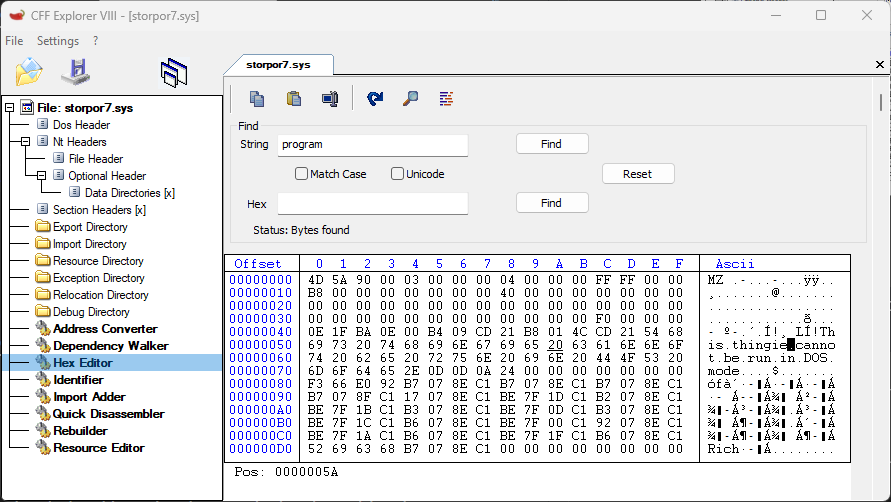
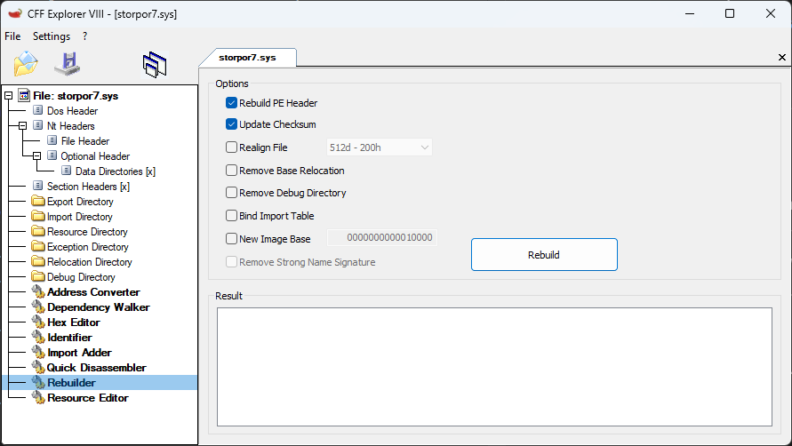

The right tools are needed to backport drivers.

In order to backport drivers, you will need at minimum a hex editor and a program to recalculate the checksums of the drivers. CFF Explorer can act as both.

An import table editor is needed in order to change the import tables, so that incompatible drivers are redirected from **ntoskrnl.exe** and **storport.sys** to **ntoskrn8.sys** and **storpor8.sys**. This can be done using a hex editor.

A hex editor is used to rewrite the security cookie in backported Windows 8 drivers. It is also used to rewrite driver code in order to bypass additional incompatabilities.

After editing, the checksum of drivers need to be recalculated, and the new checksum needs to be written back into the driver. If the checksum does not match, the driver may fail to load.

## Goal
Get familiar with CFF Explorer to backport drivers.

## Requirements
- A Windows system that can run CFF Explorer
- [CFF Explorer](https://ntcore.com/?page_id=388) ([download](https://ntcore.com/files/CFF_Explorer.zip))

## Instructions

### Open a driver
This can be done either through the **File** menu, or by drag-and-drop of the driver into the CFF Explorer window.

### Modify import directory
A driver, by default, will rely on specific files in the `C:\Windows\system32\driver` directory. The file dependencies are listed in the import directory of the driver. Using CFF Explorer, the import directory can be edited to point to a different file, which makes the driver depend on another file instead.

1. Select **Import Directory**.
2. Double-click the file name of the entry that needs to be modified.
3. Provide the new name and press **Enter**.
    - Note that the file name cannot be longer than the name that already exists for the file.
4. Save the driver.

### Hex editing
Hex editing is required in some cases, such as replacing the security cookie in Windows 8 drivers, or rewriting incompatible code.

#### Find menu
1. Select **Hex Editor**.
2. Click the magnifying glass icon to open the **Find** menu.

    - Do not use **CTRL+F**, as it will not open the menu.
3. Provide input for either **String** or **Hex**.
    - **Hex** input cannot have space separators.
4. If not already at the top of the file, make sure to scroll all the way to the top and click the first entry to set the cursor to the start of the driver.

    - If this is not done, then **Find** will look for the first match **after** the position of the cursor.
5. Click the **Find** button that matches the same row as the input.

6. Click **Find** again to look for the next match.

#### Rewrite bytes
> [!Note]
> Valid hexadecimal values are 0 to 9, and A to F.

1. Click to set the cursor at the start of the bytes to be rewritten, to the right of the **Offset** column.
2. Enter hexadecimal values.
3. Save the driver.

#### Rewrite string
> [!Note]
> A string is text, but with an extra byte to mark the end. To mark the end of a string, append a 00 byte to the last byte in the text.

1. Click to set the cursor at the start of the bytes to be rewritten, in the **Ascii** column.
2. Enter text values. If the 00 ending byte is overwritten, it needs to be appended to the text.
3. Save the driver.

> [!Note]
> To rewrite Unicode string, you will need to modify every other character. For example, `p.r.o.g.r.a.m.` would need to be written as `t.h.i.n.g.i.e.`.

### Recalculate checksum
Whenever a driver is changed, the checksum will need to be recalculated. CFF Explorer will not only recalculate the checksum, but it will also write the new checksum back into the driver.

1. Select **Rebuilder**.
2. Check the option to **Update Checksum**.
3. Click **Rebuild**.
4. Save the driver.

