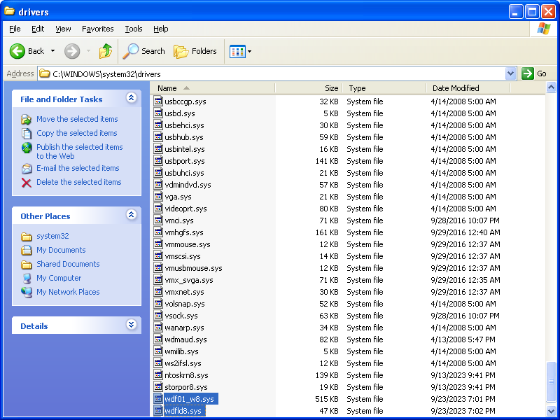

[<< Back to home directory](../index.md)

# Step 3: Porting Win 7's WDF 1.11 to Win XP/2003
Some drivers in Windows 7 and 8 require WDF 1.11, which is not available in Windows XP. The latest verison of WDF that supports Windows XP is 1.9. By applying some changes, the system modules will be usable in Windows XP, therefore improving the success of backporting drivers.

If the system is newer than Windows XP or Server 2003, then skip this step.

## Goal
There should be two new files installed in the target system: **wdfld8.sys** and **wdf01_w8.sys**. Both files will be backported to Windows XP/2003.

## Requirements
- Windows 7 or newer ([expand command is bugged in older versions](https://ss64.com/nt/expand.html))

## Instructions

### Download and extract
1. Download update [KB3125574](https://www.catalog.update.microsoft.com/Search.aspx?q=KB3125574) from Windows Update Catalog. Move the downloaded file to a clean folder.

    - 32-bit: Choose **Update for Windows 7 (KB3125574)**.
    - 64-bit: Choose **Update for Windows 7 for x64-based Systems (KB3125574)**.
2. Open command prompt and navigate to the directory containing the downloaded update file.

3. Run the following commands:
    - 32-bit:
        ```bat
        expand windows6.1-kb3125574-v4-x86_ba1ff5537312561795cc04db0b02fbb0a74b2cbd.msu -F:Windows6.1-KB3125574-v4-x86.cab .
        expand Windows6.1-KB3125574-v4-x86.cab -F:wdf01000.sys .
        expand Windows6.1-KB3125574-v4-x86.cab -F:wdfldr.sys .
        ```
        
    - 64-bit:
        ```bat
        expand windows6.1-kb3125574-v4-x64_2dafb1d203c8964239af3048b5dd4b1264cd93b9.msu -F:Windows6.1-KB3125574-v4-x64.cab .
        expand Windows6.1-KB3125574-v4-x64.cab -F:wdf01000.sys .
        expand Windows6.1-KB3125574-v4-x64.cab -F:wdfldr.sys .
        ```
        
4. A new folder should appear, containing the files **wdf01000.sys** and **wdfldr.sys**. Move these files to a more convenient place for editing.


### Rename
WDF 1.9 already installs its own **wdf01000.sys** and **wdfldr.sys**. WDF 1.11 must not override the 1.9 files, or risk system instability. To work around this issue, the WDF 1.11 files will be renamed.

As a side effect, all backported drivers that depend on any of the two WDF 1.11 files will also need to have the import tables modified to reflect these new names.

1. Rename **wdf01000.sys** to **wdf01_w8.sys**.
2. Rename **wdfldr.sys** to **wdfld8.sys**.


### Modify with [CFF Explorer](../02_cff_explorer/index.md)

#### wdf01_w8.sys

1. In **Import Directory**:
    - Change the entry for **ntoskrnl.exe** to **ntoskrn8.sys**.
    - Change the entry for **wdfldr.sys** to **wdfld8.sys**.

2. In **Rebuilder**, recalculate the checksum.
3. Save the file.

#### wdfld8.sys

1. In **Hex Editor**, search for the **Hex** `640030003000300`.
    - This is to search for the **Unicode** string `\Registry\Machine\System\CurrentControlSet\Services\Wdf%02d000`, but the **Unicode** search option is bugged.
2. Replace the **Hex** values with `64 00 5F 00 77 00 38 00`.
    - This replaces the string with `\Registry\Machine\System\CurrentControlSet\Services\Wdf%02d_w8`.

3. Scroll to the top of the file and set the cursor to the first entry. Search for the **Hex**:
    - 32-bit: `F6781BF6`
    - 64-bit: `85FF782A`
4. Replace the **Hex** values with:
    - 32-bit: `F6 EB 1B F6`
    
    - 64-bit: `85 FF EB 2A`
    
5. In **Rebuilder**, recalculate the checksum.
6. Save the file.

### Install
The files will need to be installed manually before any backported driver can be installed.

1. Transfer **wdf01_w8.sys** and **wdfld8.sys** to somewhere accessible to the target system, such as a flash drive or a network-accessible folder.
2. In your target system, move the files into the folder at `C:\Windows\system32\drivers`.

