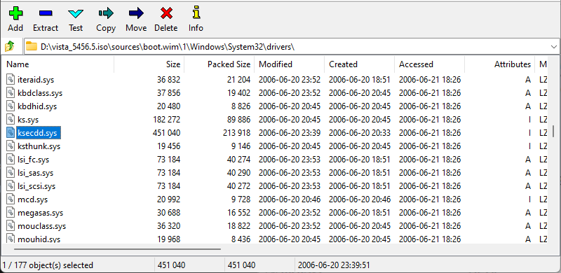

Microsoft Kernel Security Support Provider Interface, **ksecdd.sys**, is required by various drivers, but the one provided by Windows XP/2003 will not work with newer drivers. The file will need to be backported from a newer version of Windows in order to enable additional driver support for Windows XP/2003.

The purpose of **ksecdd.sys** is to support software-based cryptography at the kernel/driver level[^1] [^2].

## Goal
There should be one new file installed in the target system: **ksecd8.sys**. The file will be backported to Windows XP/2003.

## Requirements
- Windows Vista Beta 5456.5 ISO file
    - You will have to find this one on your own.
    - Make sure that the CPU architecture of the file matches your target system.
- [7-Zip](https://7-zip.org/)
- [CFF Explorer](../02_cff_explorer/index.md)

## Instructions

### Extract
The original file will need to be extracted from the ISO file using 7-Zip.

1. Using 7-Zip, **Open Archive** on the Windows Vista Beta 5456.5 ISO file.

2. In 7-Zip File Manager, navigate to `\sources\boot.wim\1\Windows\System32\drivers\`.
3. Locate **ksecdd.sys** and extract the file to a convenient location.

### Rename
Windows already has its own version of **ksecdd.sys**, so the file needs to be renamed to prevent name collision.

As a side effect, all backported drivers that depend on **ksecdd.sys** will also need to have the import tables modified to reflect the new name.

1. Rename **ksecdd.sys** to **ksecd8.sys**.

### Modify with [CFF Explorer](../02_cff_explorer/index.md)

1. In **Import Directory**, change the entry for **ntoskrnl.exe** to **ntoskrn8.sys**.

2. In **Rebuilder**, recalculate the checksum.
3. Save the file.

### Install
The files will need to be installed manually before any backported driver can be installed.

1. Transfer **ksecd8.sys** to somewhere accessible to the target system, such as a flash drive or a network-accessible folder.
2. In your target system, move the files into the folder at `C:\Windows\system32\drivers`.

## References
[^1]: https://learn.microsoft.com/en-us/windows/win32/seccng/cng-features
[^2]: https://learn.microsoft.com/en-us/windows-server/security/windows-authentication/credentials-processes-in-windows-authentication