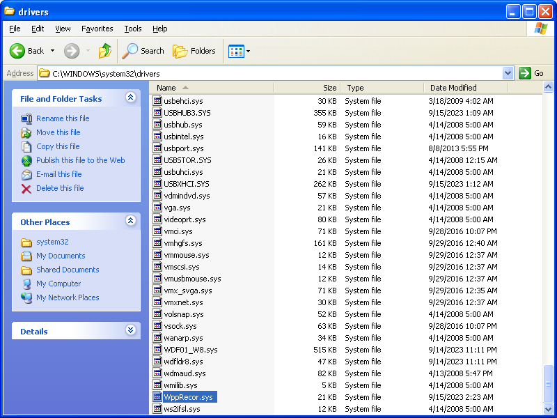

**WppRecorder.sys** is used by Windows drivers for logging. Because it is a dependency of some drivers, it needs to be backported to Windows XP/2003.

## Goal
There should be one new file installed in the target system: **WppRecorde8.sys**. The file will be backported to Windows XP/2003.

## Requirements
- Windows 8 ISO file **(not Windows 8.1)**
    - You will have to find this one on your own.
    - Make sure that the CPU architecture of the file matches your target system.
- [7-Zip](https://7-zip.org/)
- [CFF Explorer](../02_cff_explorer/index.md)

## Instructions

### Extract
The original file will need to be extracted from the ISO file using 7-Zip.

1. Using 7-Zip, **Open Archive** on the Windows 8 ISO file.

2. In 7-Zip File Manager, navigate to `\sources\boot.wim\1\Windows\System32\drivers\`.
3. Locate **WppRecorder.sys** and extract the file to a convenient location.

### Rename
Windows may have its own version of **WppRecorder.sys**, so the file should be renamed to prevent name collision.

As a side effect, all backported drivers that depend on **WppRecorder.sys** will also need to have the import tables modified to reflect the new name.

1. Rename **WppRecorder.sys** to **WppRecorde8.sys**.

### Modify with [CFF Explorer](../02_cff_explorer/index.md)

1. In **Hex Editor**, search for the **Hex**:
    - 32-bit: `4EE640BB`
    - 64-bit: `32A2DF2D992B`
    - This is to search for the security cookie, which if not modified, will prevent the driver from being installed.
    - Make sure it finds the very first match! There may be multiple copies of this hex value, but **only the first match** in the file needs to be modified!
2. Replace the first **Hex** value with `00`.
    - 32-bit:
    
    - 64-bit:
    
3. In **Rebuilder**, recalculate the checksum.
4. Save the file.

### Install
The files will need to be installed manually before any backported driver can be installed.

1. Transfer **WppRecorde8.sys** to somewhere accessible to the target system, such as a flash drive or a network-accessible folder.
2. In your target system, move the files into the folder at `C:\Windows\system32\drivers`.

