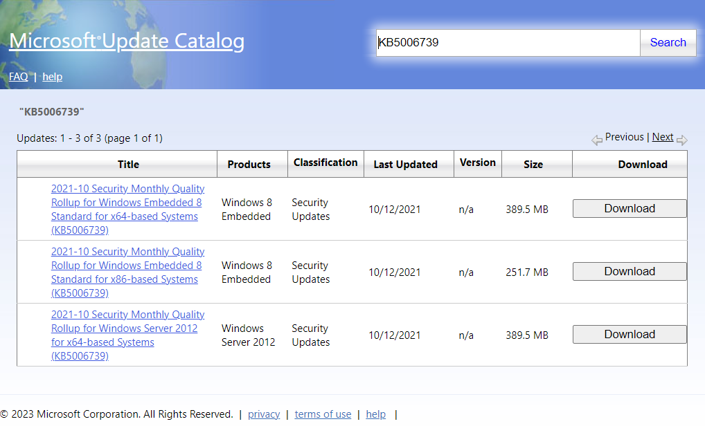

[Click here for the image-less version >>](printable.md)

Windows XP/2003 natively supports USB 2.0 without the need for custom drivers. However, the speed of USB 2.0 is limited when compared to USB 3.0. Not only that, but USB 3.0 devices plugged into a USB 3.0 port may refuse to work when drivers are not installed.

A manufacturer may develop USB 3.0 drivers specifically for Windows XP/2003. When that option is not available, the user would typically either accept USB 2.0 speeds in Windows XP/2003, or move to a new operating system where such drivers are available. With NTOSKRNL\_Emu, there is another option: backport the Windows 8 USB 3.0 driver to Windows XP.

## Goal
The Windows 8 USB 3.0 drivers will be installed in the target system. The drivers will be backported to Windows XP/2003.

## Prerequisites
- [NTOSKRNL\_Emu](../01_build_ntoskrnl_emu/index.md)
- [WDF 1.11](../03_wdf_1_11/index.md)
- [ksecd8.sys](../04_ksecd8_sys/index.md)
- [WppRecorde8.sys](../05_wpprecorde8_sys/index.md)

## Requirements
- Windows 7 or newer ([expand command is bugged in older versions](https://ss64.com/nt/expand.html))
- [CFF Explorer](../02_cff_explorer/index.md)
- USB 3.0 port
    - Without a USB 3.0 port, there is no point to installing USB 3.0 drivers.

## Instructions

### Download and extract

#### KB2984005
1. Download update [KB2984005](https://www.catalog.update.microsoft.com/Search.aspx?q=KB2984005) from Windows Update Catalog. Move the downloaded file to a clean folder.

    

    - 32-bit: Choose **Update for Windows 8 (KB2984005)**.
    - 64-bit: Choose **Update for Windows 8 for x64-based Systems (KB2984005)**.

2. Open command prompt and navigate to the directory containing the downloaded update file.

    

3. Run the following commands:
    - 32-bit:
        ```bat
        expand windows8-rt-kb2984005-x86_77577a115a33b0478b508c69677ed44761e9fc8f.msu -F:windows8-rt-kb2984005-x86.cab .
        expand windows8-rt-kb2984005-x86.cab -F:usbhub3.inf .
        expand windows8-rt-kb2984005-x86.cab -F:usbhub3.sys .
        ```

        

    - 64-bit:
        ```bat
        expand windows8-rt-kb2984005-x64_96505708f4f2f01f8e76408cf2c74016dd5d1032.msu -F:windows8-rt-kb2984005-x64.cab .
        expand windows8-rt-kb2984005-x64.cab -F:usbhub3.inf .
        expand windows8-rt-kb2984005-x64.cab -F:usbhub3.sys .
        ```

        

4. Two new folders should appear. Enter the folder containing the name `6.2.9200.21180`.

    

    - Both folders contain the same driver, but they are different versions of that driver. You want to pick the newest version.

5. The folder contains the files **usbhub3.inf** and **usbhub3.sys**. Move these files to a more convenient place for editing.

    

#### KB5006739
1. Download update [KB5006739](https://www.catalog.update.microsoft.com/Search.aspx?q=KB5006739) from Windows Update Catalog. Move the downloaded file to a clean folder.

    

    - 32-bit: Choose **2021-10 Security Monthly Quality Rollup for Windows Embedded 8 Standard for x86-based Systems (KB5006739)**.
    - 64-bit: Choose **2021-10 Security Monthly Quality Rollup for Windows Embedded 8 Standard for x64-based Systems (KB5006739)**.

2. Open command prompt and navigate to the directory containing the downloaded update file.

    

3. Run the following commands:
    - 32-bit:
        ```bat
        expand windows8-rt-kb5006739-x86_126562a0710a0dac87edd8497c13a32973962d01.msu -F:windows8-rt-kb5006739-x86.cab .
        expand windows8-rt-kb5006739-x86.cab -F:ucx01000.sys .
        expand windows8-rt-kb5006739-x86.cab -F:usbxhci.inf .
        expand windows8-rt-kb5006739-x86.cab -F:usbxhci.sys .
        expand windows8-rt-kb5006739-x86.cab -F:usbd.sys .
        ```

        

    - 64-bit:
        ```bat
        expand windows8-rt-kb5006739-x64_3d984253b421c404b2fbd71ba5728c2194774142.msu -F:windows8-rt-kb5006739-x64.cab .
        expand windows8-rt-kb5006739-x64.cab -F:ucx01000.sys .
        expand windows8-rt-kb5006739-x64.cab -F:usbxhci.inf .
        expand windows8-rt-kb5006739-x64.cab -F:usbxhci.sys .
        expand windows8-rt-kb5006739-x64.cab -F:usbd.sys .
        ```

        

4. Two new folders should appear, containing the files **ucx01000.sys**, **usbxhci.inf**, **usbxhci.sys**, and **usbd.sys**. Move these files to a more convenient place for editing.

    

### Rename
Windows XP/2003 already has its own **usbd.sys**. The Windows 8 driver must not override the existing driver, or risk system instability. To work around this issue, the Windows 8 driver will be renamed.

As a side effect, all backported drivers that depend on **usbd.sys** will also need to have the import tables modified to reflect the new name.

1. Rename **usbd.sys** to **usb8.sys**.

    

### Modify with [CFF Explorer](../02_cff_explorer/index.md)

#### ucx01000.sys

1. In **Import Directory**:
    - Change the entry for **ntoskrnl.exe** to **ntoskrn8.sys**.
    - Change the entry for **wdfldr.sys** to **wdfld8.sys**.
    - Change the entry for **WppRecorder.sys** to **WppRecorde8.sys**.

    

2. In **Hex Editor**, search for the **Hex**:
    - 32-bit: `4EE640BB`
    - 64-bit: `32A2DF2D992B`
    - This is to search for the security cookie, which if not modified, will prevent the driver from being installed.
    - Make sure it finds the very first match! There may be multiple copies of this hex value, but **only the first match** in the file needs to be modified!

3. Replace the first **Hex** value with `00`.
    - 32-bit:

        

    - 64-bit:
        

4. In **Rebuilder**, recalculate the checksum.

5. Save the file.

#### usb8.sys

1. In **Import Directory**, change the entry for **ntoskrnl.exe** to **ntoskrn8.sys**.

    

2. In **Hex Editor**, search for the **Hex**:
    - 32-bit: `4EE640BB`
    - 64-bit: `32A2DF2D992B`
    - This is to search for the security cookie, which if not modified, will prevent the driver from being installed.
    - Make sure it finds the very first match! There may be multiple copies of this hex value, but **only the first match** in the file needs to be modified!

3. Replace the first **Hex** value with `00`.
    - 32-bit:

        

    - 64-bit:

        

4. In **Rebuilder**, recalculate the checksum.

5. Save the file.

#### usbhub3.sys

1. In **Import Directory**:
    - Change the entry for **ksecdd.sys** to **ksecd8.sys**.
    - Change the entry for **ntoskrnl.exe** to **ntoskrn8.sys**.
    - Change the entry for **usbd.sys** to **usb8.sys**.
    - Change the entry for **wdfldr.sys** to **wdfld8.sys**.
    - Change the entry for **WppRecorder.sys** to **WppRecorde8.sys**.

    

2. In **Hex Editor**, search for the **Hex**:
    - 32-bit: `4EE640BB`
    - 64-bit: `32A2DF2D992B`
    - This is to search for the security cookie, which if not modified, will prevent the driver from being installed.
    - Make sure it finds the very first match! There may be multiple copies of this hex value, but **only the first match** in the file needs to be modified!

3. Replace the first **Hex** value with `00`.
    - 32-bit:

        

    - 64-bit:

        

4. Scroll to the top of the file and set the cursor to the first entry. Search for the **Hex**:
    - 32-bit: `837E54037509`
    - 64-bit: `00000003750A`

5. Replace the **Hex** values with:
    - 32-bit: `83 7E 54 03 EB 09`

        

    - 64-bit: `00 00 00 03 EB 0A`

        

6. In **Rebuilder**, recalculate the checksum.

7. Save the file.

#### usbxhci.sys

1. In **Import Directory**:
    - Change the entry for **ntoskrnl.exe** to **ntoskrn8.sys**.
    - Change the entry for **wdfldr.sys** to **wdfld8.sys**.
    - Change the entry for **WppRecorder.sys** to **WppRecorde8.sys**.

    

2. In **Hex Editor**, search for the **Hex**:
    - 32-bit: `4EE640BB`
    - 64-bit: `32A2DF2D992B`
    - This is to search for the security cookie, which if not modified, will prevent the driver from being installed.
    - Make sure it finds the very first match! There may be multiple copies of this hex value, but **only the first match** in the file needs to be modified!

3. Replace the first **Hex** value with `00`.
    - 32-bit:

        

    - 64-bit:

        

4. In **Rebuilder**, recalculate the checksum.

5. Save the file.

### Modify .inf files

#### usbhub3.inf

1. Open **usbhub3.inf** with **Notepad.exe**.

2. Search for `[Generic.Install.NT.Services]`.

3. **Under** the line that starts with `AddService`, add the following line:

    ```
    AddService=WDF01_W8,,  WDF.AddService
    ```

4. **Above** the line `[Generic.AddService]`, add the following line:

    ```
    [WDF.AddService]
    DisplayName    = "Windows Driver Framework v1.11 for XP/2003"
    ServiceType    = 1                  ; SERVICE_KERNEL_DRIVER
    StartType      = 3                  ; SERVICE_DEMAND_START
    ErrorControl   = 1                  ; SERVICE_ERROR_NORMAL
    ServiceBinary  = %12%\WDF01_W8.SYS
    LoadOrderGroup = Base
    ```

    

5. Save the file.

6. Repeat steps 1 to 5 for **usbxhci.inf**

    

### Install

#### Transfer
1. Transfer **ucx01000.sys**, **usb8.sys**, **usbhub3.inf**, **usbhub3.sys**, **usbxhci.inf**, and **usbxhci.sys** to somewhere accessible to the target system, such as a flash drive or a network-accessible folder.

#### Install **usb8.sys** and **ucx01000.sys**
These files will need to be installed manually before any of the backported drivers can be installed.

1. In your target system, move **usb8.sys** and **ucx01000.sys** into the folder at `C:\Windows\system32\drivers`.

    

#### Install USB 3.0 drivers

1. Open the **Start** menu and click **Run...**.

    

2. Run **devmgmt.msc**. This will open **Device Manager**.

    

3. Open the category **Other devices**, right-click **Universal Serial Bus (USB) Controller**, and select **Update Driver...**. A new window will open up.

    

4. Select **No, not this time.** and click **Next**.

    

5. Select **Install from a list or specific location (Advanced)** and click **Next**.

    

6. Uncheck **Search removable media (floppy, CD-ROM, ...)**.

7. Check **Include this location in the search**. Click **Browse...** and locate the directory containing the drivers. Click **Next**.

    

8. The first set of drivers have been installed. With every new USB 3.0 device, a new dialogue box will appear for installing the USB 3.0 drivers. Repeat steps 4 to 7 to complete the installation.
